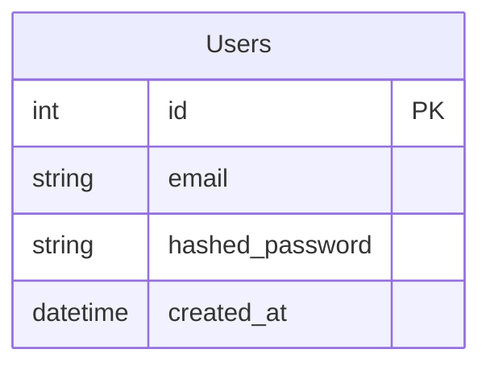

# Database Diagram & Data Dictionary

## ER Diagram

*Note: The Repository entity is mapped directly from GitHub, but can be scaled to support saving per-user later.*

## Entities
- **Users**: Core user table for authentication. Password validated to be hexadecimal and min 6 characters.
